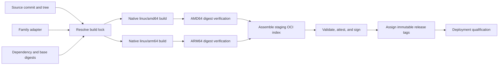

# Container Image Build Process

Status: design-only. No executable build or release pipeline is implemented.

## Purpose

This repository is the control plane for Local Inference Lab container images.
It turns reviewed source and dependency identities into independently verified
`linux/amd64` and `linux/arm64` images, then publishes one multi-platform OCI
index. The first image family is the Local Inference Lab vLLM fork. SGLang uses
the same control-plane contract without sharing vLLM-specific build logic.

The process optimizes for correctness and maintainability rather than the
smallest number of build commands. CUDA extensions, Python wheels, and runtime
checks differ by CPU architecture. Those differences remain explicit until the
release index is assembled.

## Design constraints

- OCI uses `amd64` for x86-64 and `arm64` for AArch64.
- CUDA and C++ extensions build on a native CPU architecture. QEMU is not a
  release-build fallback.
- Each runnable platform image is verified by digest on a compatible NVIDIA
  GPU before it enters a release index.
- The source repository owns its Dockerfile and dependency locks. This
  repository does not carry a second copy of either vLLM or SGLang recipes.
- Every material input is immutable: source commits and trees, base-image
  platform manifests, downloaded artifacts, dependency locks, build arguments,
  and adapter content.
- Model weights, credentials, writable caches, host-specific environment files,
  and deployment topology do not enter an image.
- A release index is complete or absent. A partial index is not published under
  a release tag.
- Build verification and deployment qualification are distinct. An image can be
  verified without being qualified for every model, quantization, topology, or
  workload.

## Ownership boundaries

| Component | Responsibility |
| --- | --- |
| vLLM or SGLang source repository | Source code, source-specific Dockerfile, dependency locks, build stages, and compiled package layout |
| `container-build` | Build policy, family adapters, resolved locks, common metadata, verification orchestration, and release-index assembly |
| Executor configuration | Platform-to-builder mapping, Docker contexts, credentials, caches, concurrency, and resource admission |
| Deployment configuration | Models, quantization, serving topology, runtime arguments, benchmarks, operational health, and rollback |

A source-specific exception belongs in that source's family adapter. Shared
controller code changes only when the invariant applies to every image family.

## Core decisions

### Native platform builds remain separate

The controller starts one native build for each required platform. A platform
can be retried without rebuilding the other platform, and no manifest assembly
occurs until both verification records exist. A single emulated
`buildx --platform linux/amd64,linux/arm64` invocation is not the release
boundary.

A GPU is not normally required during the Docker build. It is required during
image verification. The initial trusted execution mapping is:

| OCI platform | Native build and verification host | Verification GPU |
| --- | --- | --- |
| `linux/amd64` | `ripper` | NVIDIA RTX PRO 6000 Blackwell |
| `linux/arm64` | `maxwell` | NVIDIA DGX Spark GB10 |

The mapping is executor configuration, not image identity. A native cloud
builder or private scheduler can replace either build host without changing a
family definition or build lock.

### The public repository is not a homelab runner entry point

GitHub recommends that self-hosted runners almost never be attached to public
repositories because pull-request code can persistently compromise the runner.
GitHub Actions in this repository may validate documentation, schemas, and lock
syntax on GitHub-hosted runners. They do not run source Dockerfiles or dispatch
jobs to persistent Local Inference Lab hosts.

The initial executor is a trusted controller using native Docker contexts over
SSH. A future private scheduler may call the same controller interface. CI is a
caller; it does not duplicate build policy.

### A resolved lock is the complete build identity

A human-readable source ref is resolved before a build begins. The result is a
deterministically formatted JSON lock containing every material input. The
build ID is the SHA-256 digest of the exact lock bytes.

Changing source, dependencies, bases, CUDA targets, recipe content, finalizer
content, or build arguments creates a different lock and build ID. Reformatting
the generated lock also creates a different ID, so the resolver owns stable
formatting.

### Runnable images precede the release index

Each platform build produces a runnable image manifest and BuildKit metadata
manifests. The controller identifies and verifies the runnable image manifest,
not merely the platform build's root digest. The release index is assembled
from the verified runnable descriptors and their validated metadata
descriptors.

This distinction is required because a BuildKit result with provenance or an
SBOM is normally an OCI image index. Its `manifests` array contains a runnable
image manifest plus one or more `unknown/unknown` attestation manifests.

### Publication is not deployment qualification

Artifact verification proves identity, package layout, compiled-extension
loading, and GPU compatibility. Deployment qualification additionally covers a
specific model, quantization, optional backend, topology, API behavior, output
quality, performance, and rollback. Those records refer to the immutable
published digest but remain outside this repository's generic release state.

## Artifact model



The registry is the rendezvous point between native builders and the index
assembler. Build caches accelerate work but are never release artifacts or
provenance authorities.

## Proposed repository structure

The following structure describes the intended boundaries; it is not an
implemented file inventory.

```text
container-build/
├── images/
│   ├── common/
│   │   └── finalize.Dockerfile
│   ├── vllm/
│   │   ├── family.yaml
│   │   ├── docker-bake.hcl
│   │   └── verify
│   └── sglang/
│       ├── family.yaml
│       ├── docker-bake.hcl
│       └── verify
├── locks/
│   ├── vllm/
│   └── sglang/
├── schemas/
│   ├── family.schema.json
│   └── build-lock.schema.json
├── tools/
│   └── imagectl
└── .github/
    └── workflows/
        └── validate.yaml
```

One controller, `imagectl`, owns resolution, validation, native dispatch,
evidence collection, index assembly, and publication. Family adapters do not
reimplement those operations.

## Artifact contracts

### Family definition

A family definition contains stable policy:

- family and variant names;
- allowed source repository;
- output registry repository;
- source Dockerfile and Bake target;
- supported OCI platforms;
- platform-specific CUDA architecture lists and build arguments;
- dependency-lock location and required input declarations;
- common metadata requirements;
- runnable entrypoint;
- compiled-extension and GPU verification contract.

It contains no source revision, builder hostname, registry credential, cache
path, model identity, or release tag.

### Build lock

A build lock contains resolved inputs:

- schema version, family, and variant;
- source repository, full commit, and Git tree;
- source recipe and dependency-lock digests;
- family adapter and common finalizer content digests;
- platform-specific build arguments;
- build and final base-image child manifest digests for each platform;
- every externally fetched archive or package identity required by the source
  recipe;
- expected OCI platforms;
- output repository and requested immutable release aliases.

Secrets are referenced by capability, never by value. Mutable tags and branches
may be resolution inputs but never appear as resolved artifact identities.

### Executor configuration

Executor configuration is local and uncommitted. It maps an OCI platform to a
native Docker or BuildKit endpoint and declares cache, concurrency, and resource
admission policy. A typical local controller maps Docker contexts backed by SSH
to `ripper` and `maxwell`.

Registry authentication is injected for one invocation and is not written into
a build context, lock, image, or log. Builders do not retain a release token as
part of their configuration.

### In-image manifest and OCI labels

The common finalizer adds
`/opt/local-inference-lab/image-manifest.json` to each runnable image. The
manifest records:

- build ID and full lock digest;
- family and variant;
- source repository, commit, and tree;
- platform and compiled CUDA targets;
- source recipe, dependency lock, adapter, and finalizer digests;
- build and final base-image digests;
- declared external dependency identities.

Required OCI labels include the standard source, revision, version, license,
and description labels plus Local Inference Lab labels for the family, variant,
build ID, lock digest, source tree, and platform.

Verification status is not an image label. Verification happens after the image
digest exists; adding a status label afterward would create a different image.

### Verification evidence

Each platform verification produces a machine-readable statement containing:

- build ID and lock digest;
- runnable image manifest digest;
- platform build root digest;
- observed platform, GPU model, driver, and CUDA capability;
- exact checks and exit states;
- required import and kernel-registration results;
- referenced provenance and SBOM attestation digests;
- pass or fail conclusion.

The statement is stored as an OCI artifact or durable release artifact. A
release statement names both verification-statement digests and is attached to
the final index by subject.

## Image identity and tags

The canonical immutable tag is:

```text
ghcr.io/local-inference-lab/${FAMILY}:build-${LOCK_SHA256}
```

Platform build roots use internal staging tags:

```text
candidate-${BUILD_ID}-amd64
candidate-${BUILD_ID}-arm64
```

A reviewed semantic alias such as `0.x.y-lil.1` is immutable. The publisher
rejects an existing immutable tag unless it already resolves to the expected
index digest.

No `latest` tag is created initially. A mutable channel such as `edge`, if
adopted, moves through a separate promotion operation after release
publication. Build jobs never update channel tags.

Consumers use the multi-platform index digest or an immutable index tag. They
do not use internal platform staging tags.

## Release lifecycle

### Resolve

1. Resolve the requested source ref to a full commit and Git tree.
2. Verify that the commit belongs to the allowed source repository.
3. Resolve every base-image index to its platform child manifests.
4. Verify dependency locks and digest declarations for every network input.
5. Merge family policy with release-specific inputs.
6. Record all build-affecting adapter and finalizer content digests.
7. Emit a deterministic build lock and its SHA-256 build ID.
8. Review and merge the lock before any native build executes.

A source archive is exported by commit. An uncommitted worktree is never copied
into a build context.

### Build

For each required platform, independently:

1. Export and verify the locked source tree.
2. Select the locked platform-specific base-image child digests.
3. Invoke the source-owned Dockerfile through the family Bake adapter.
4. Build the source payload image on the native architecture.
5. Finalize the payload with the common in-image manifest and OCI labels.
6. Push the platform result with BuildKit provenance and SBOM generation
   enabled.
7. Record the root descriptor returned by the registry.
8. Parse the root index and identify the runnable and attestation descriptors
   according to the OCI contract below.

A cache hit may skip work but cannot change any output requirement. BuildKit
and compiler caches are scoped by family and CPU architecture. Only trusted
builds write shared caches.

### Verify

Pull the candidate by its runnable manifest digest on the corresponding GPU
host. The family verifier checks:

- the manifest platform equals the locked platform;
- OCI labels and the in-image manifest agree with the lock;
- the CLI version and entrypoint are correct;
- CUDA is visible;
- the observed device capability is supported by the compiled image;
- every family-declared compiled extension, backend, and kernel registration
  imports successfully;
- the process terminates normally.

The verifier also validates provenance and SBOM subjects against the runnable
manifest digest. A matching staging tag is insufficient.

A failed platform remains a candidate. It does not contribute a descriptor to
any release index.

### Assemble

Assembly consumes two verified platform records, not two unexamined build-root
digests.

1. Require one verified runnable descriptor for `linux/amd64` and one for
   `linux/arm64`.
2. Require both records to reference the same build ID and lock digest.
3. Copy the two runnable descriptors without changing their digests.
4. Copy every validated BuildKit attestation descriptor associated with those
   runnable manifests.
5. Create a staging OCI image index from those descriptors.
6. Inspect the raw index using the validation rules below.
7. Record the staging index digest.
8. Attach the release verification statement and signature as OCI referrers to
   that final index digest.
9. Apply immutable build and semantic tags to the already validated and signed
   index digest.

The final index therefore contains exactly two runnable platform manifests but
may contain more than two descriptors in total.

### Publish and promote

Publication refuses to overwrite an immutable tag with different bytes. A
successful rerun exits without mutation when every requested immutable tag
already resolves to the recorded index digest.

Mutable channel movement is a distinct operation with its own authorization and
record. It retargets an alias to an existing immutable index; it never rebuilds
or modifies that image.

### Deployment qualification

A deployment profile refers to the immutable release digest and separately
records:

- model and quantization;
- optional loaders, kernels, and backends;
- host and interconnect topology;
- runtime arguments and cache namespace;
- model-load, API, correctness, and performance evidence;
- predecessor image and rollback procedure.

Artifact verification does not imply that these deployment gates passed.

## OCI index and attestation contract

BuildKit provenance and SBOM output changes the shape of a nominally
single-platform push. The controller uses the following terms and rules to
avoid treating metadata as a runnable platform.

### Descriptor classes

A **platform build root** is the digest returned for one native platform build.
With BuildKit attestations enabled, it is expected to be an OCI image index.
It is not automatically the runnable image digest.

A **runnable descriptor**:

- uses an OCI or Docker image-manifest media type supported by the registry;
- declares a concrete platform;
- has `os: linux` and exactly the expected architecture;
- resolves to a manifest with an image configuration and runnable layers;
- is not an attestation artifact.

An **attestation descriptor**:

- declares `platform.os: unknown` and
  `platform.architecture: unknown`;
- has `vnd.docker.reference.type: attestation-manifest`;
- has `vnd.docker.reference.digest` equal to its runnable subject digest;
- resolves to a manifest whose artifact type is
  `application/vnd.docker.attestation.manifest.v1+json` when OCI artifact
  storage is enabled;
- has a `subject` descriptor equal to the runnable manifest;
- contains only recognized in-toto predicate layers required by policy.

A metadata descriptor that fails these conditions is not silently ignored. It
fails assembly.

### Per-platform normalization

For each native platform build, the controller reads the raw platform build
root and requires:

- one and only one runnable descriptor for the expected platform;
- no runnable descriptor for another concrete platform;
- no nested image index as a runnable child;
- one or more valid attestation descriptors targeting that runnable digest;
- the required provenance and SBOM predicate types across those attestation
  manifests;
- no attestation whose annotation, subject, or in-toto subject names a different
  runnable digest.

The controller records the root digest, runnable digest, and attestation
digests separately. Verification uses the runnable digest. Provenance and SBOM
validation use their declared runnable subject.

### Final release index

The final release index contains:

- exactly one runnable `linux/amd64` image manifest;
- exactly one runnable `linux/arm64` image manifest;
- all validated BuildKit attestation manifests for those two runnable
  manifests;
- no other concrete platform;
- no nested platform build root indexes;
- no unrecognized `unknown/unknown` descriptor.

Validation counts runnable descriptors by media type, artifact type, and
platform. It never asserts that `manifests.length == 2`. The total descriptor
count depends on how many attestation manifests BuildKit emits and may change
without changing the two-platform runtime contract.

The assembler preserves attestation descriptors and their annotations when it
constructs the final index. It does not pass the two platform build root indexes
directly to `imagetools create`, because doing so can produce nested indexes or
obscure the runnable subjects. Descriptor files or an equivalent registry API
provide the exact runnable and attestation descriptors.

### Post-assembly subjects

The release verification statement and signature target the final release index
digest through OCI referrers. They are not inserted into the index after its
digest is computed. Per-platform BuildKit provenance and SBOM attestations keep
their original runnable-manifest subjects and remain descriptors in the final
index.

This produces a stable subject chain:

```text
final release index digest
├── runnable linux/amd64 manifest digest
│   └── BuildKit provenance and SBOM subjects
├── runnable linux/arm64 manifest digest
│   └── BuildKit provenance and SBOM subjects
└── registry referrers
    ├── release verification statement
    └── release signature
```

## Initial vLLM family

The initial family is:

| Field | Value |
| --- | --- |
| Family | `vllm` |
| Variant | `cuda13` |
| Source | `https://github.com/local-inference-lab/vllm` |
| Source target | `vllm-openai` |
| Registry | `ghcr.io/local-inference-lab/vllm` |
| `linux/amd64` CUDA targets | `8.0 8.9 9.0 10.0 11.0 12.0` |
| `linux/arm64` CUDA targets | `9.0 12.0` |

The inspected vLLM Dockerfile already branches on `TARGETPLATFORM` for sccache,
GDRCopy, bitsandbytes, and ARM-specific dependency handling. Its CUDA 13.0.2
build and runtime base tags currently expose both required OCI platforms. A
build lock records their platform child digests rather than relying on those
tags.

The upstream ARM Buildkite script is not the publication path. It builds the
`test` target and embeds Buildkite and ECR behavior. The vLLM adapter invokes
the source Bake definition and publishes the `vllm-openai` target with locked
platform arguments.

### Reproducibility blockers

The current source recipe contains network inputs that are not fully immutable,
including a mutable uv installer URL, apt repositories, and some Python version
ranges. It also identifies `vllm-project/vllm` in source labels and does not add
a generic Local Inference Lab manifest.

The common finalizer corrects image identity and adds the in-image manifest.
Dependency and tool inputs still require source-owned hash locks, snapshot
repositories, or digest-verified archives before a build can be described as
reproducible. BuildKit provenance and an SBOM describe the produced artifact;
they do not make mutable inputs deterministic.

## SGLang extension boundary

Adding SGLang requires:

1. a SGLang family definition;
2. a thin Bake adapter around the SGLang source-owned recipe;
3. a SGLang verifier;
4. resolved SGLang build locks.

The controller, schemas, finalizer, evidence model, and index-assembly contract
remain unchanged. A SGLang-specific build exception stays in the SGLang
adapter. It does not become a family-name branch in shared controller code.

## Guardrails

- One controller owns lifecycle state and registry mutation.
- One small adapter directory exists per image family.
- Source-owned Dockerfiles are not copied into this repository.
- Native builds have no QEMU release fallback.
- One reviewed lock is the complete material build identity.
- Platform build roots, runnable manifests, and attestation manifests are
  recorded as distinct digests.
- Exactly two runnable platforms are required; metadata manifest count is not
  fixed.
- No host names, credentials, cache paths, model weights, or deployment settings
  enter build locks.
- Build, verification, index assembly, immutable publication, and mutable
  channel promotion are separate state transitions.
- An immutable tag never points to different bytes.
- A partial multi-platform index never receives a release tag.
- Public pull requests never execute on Local Inference Lab hosts.
- External GitHub Actions are pinned to full commit SHAs when workflows are
  implemented.

## References

- [Local Inference Lab vLLM fork](https://github.com/local-inference-lab/vllm)
- [Docker multi-platform builds](https://docs.docker.com/build/building/multi-platform/)
- [Docker image attestation storage](https://docs.docker.com/build/metadata/attestations/attestation-storage/)
- [`docker buildx imagetools create`](https://docs.docker.com/reference/cli/docker/buildx/imagetools/create/)
- [GitHub Actions secure use reference](https://docs.github.com/en/actions/reference/security/secure-use)
